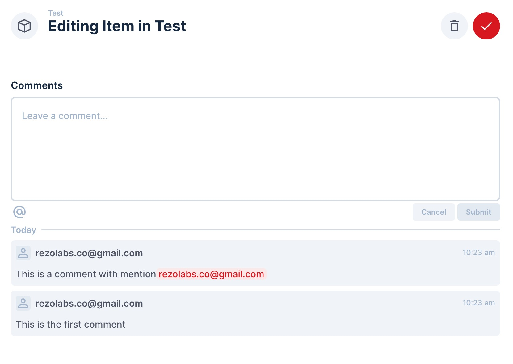

[](https://badge.fury.io/js/directus-extension-comment-interface)

# Introduction

- Display comments directly in the form. Useful when you want to view comments in the item drawer.
- Real-time update via polling.
- Sort comments chronologically in ascending/descending order.



# Installation

```
npm i directus-extension-comment-interface
```

# Get Started
1. Go to **Settings**, create a new field with type `presentation`.
2. In the **Interface** panel, choose **Comment** interface. There are 2 options:
    1. **Refresh Interval**: Time between each refresh, in seconds. Default: 10.
    2. **Sort Direction**: Sort in ascending/descending order. Default: "Ascending".
